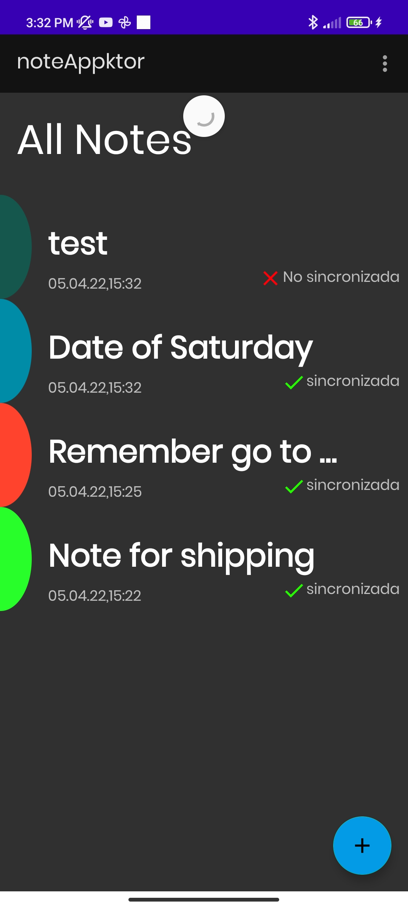
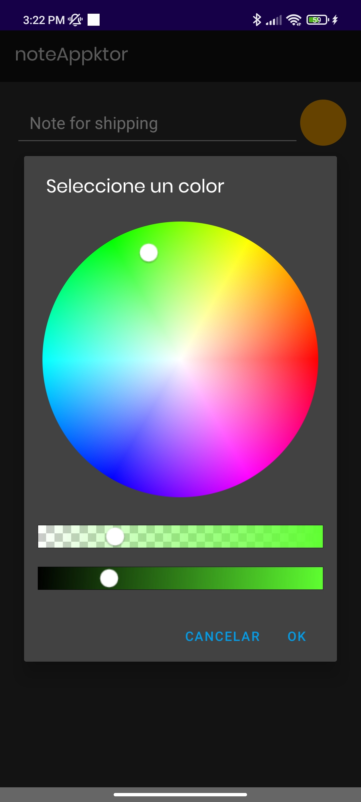
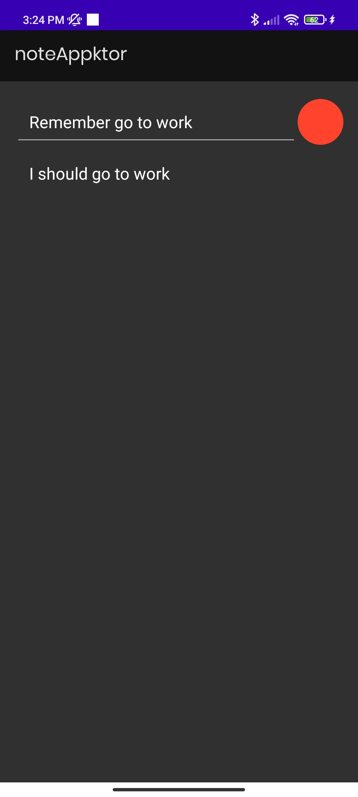
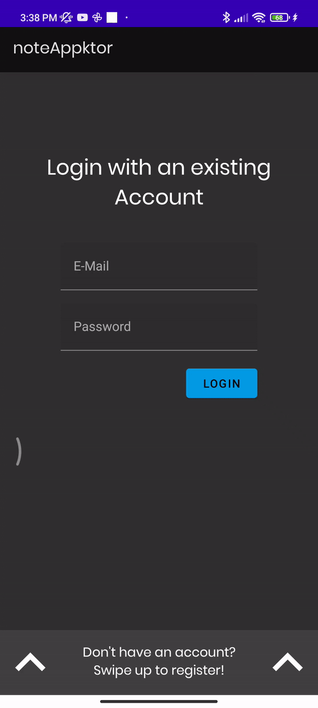
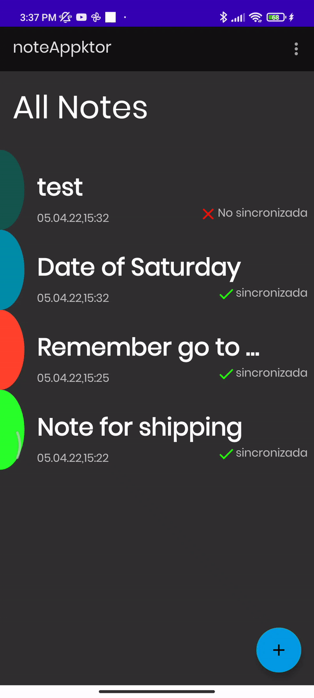
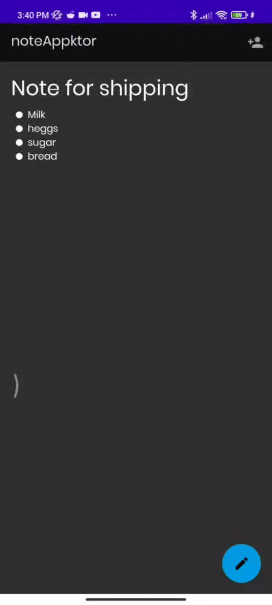

# AppNoteKtor
This application allow make notes for anything that want remember, with markdown format  for best visualisation,also you can do the next things: 
* Make, edit, delite notes.
* Select color for note.
* Synchronize notes  remotes with locally.
* Uses Markdown for  notes format.
* Shared notes with other through email.
 
### Phone display:
&ensp;

### Login With animation. 

### Visualize, sync, delete notes and add owner.
&ensp;

## Library
* [Room Persistence Library](https://developer.android.com/topic/libraries/architecture/room)
* [Retrofit](https://square.github.io/retrofit/)
* [Ktor](https://start.ktor.io)
* [View Binding](https://developer.android.com/topic/libraries/data-binding)
* [Gson](https://github.com/google/gson/)
* [Markdown](https://github.com/noties/Markwon)
* [Color Picker Dialog](https://github.com/skydoves/ColorPickerView)
* [Navigation](https://developer.android.com/guide/navigation/navigation-getting-started)
* [coroutines](https://developer.android.com/kotlin/coroutines)
* [Scale size unit](https://github.com/intuit/sdp)
* [Hilt](https://dagger.dev/hilt)

## App Architecture
* MVVM
* Clean architecture

## Developed By

Andres Diaz 
